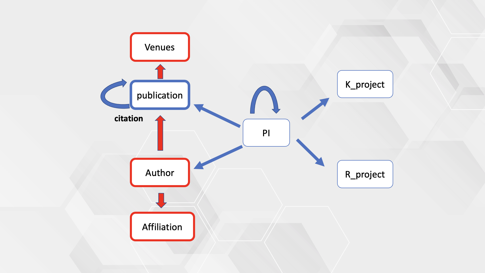

# NIHreporter

A public dataset for investigating PI funding success in National Institutes of Health. We shared the pre-processed dataset which include 7 nodes with features and 7 edges among nodes. 
The figure below indicates the relationship in this graph.

